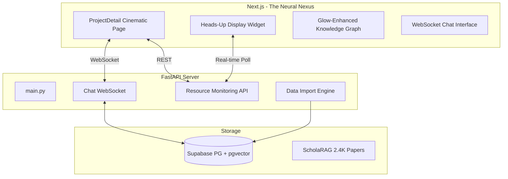

# Session Report: 2026-01-08

## 1. Executive Summary
오늘 세션에서는 **ScholaRAG_Graph**의 인프라 구축, 6.7K 규모의 실제 데이터 임포트, 그리고 프로젝트의 시각적 정체성을 확립하는 **"The Neural Nexus"** 디자인 오버홀을 완료했습니다. 시스템은 이제 실시간 데이터 스트리밍과 최첨단 UI를 갖춘 완성도 높은 분석 플랫폼으로 진화했습니다.

## 2. System Architecture (Current)

## 3. Completed Tasks (Accomplishments)

### 3.1 "The Neural Nexus" UI/UX Overhaul
- **Aesthetics**: `Slate-950` 배경, Mesh Gradient, `Outfit` 폰트, 고급 Glassmorphism (`glass-nexus`) 적용.
- **Graph Visuals**: `CustomNode` 고도화 (동적 스케일링, 상시 발광 효과, 맥박 코어), 애니메이션 엣지.
- **Components**: 실시간 시스템 메트릭을 보여주는 **HUD Widget**, 시네마틱 사이드바 및 검색바 구현.

### 3.2 Bulk Data Import (GenAI Learning Effects Meta)
- **Scale**: 1,563개 논문, 5,223명 저자, 5,375개의 관계망 데이터 임포트 성공.
- **Storage**: Supabase PostgreSQL + pgvector 연동 완료.

### 3.3 Backend Monitoring & Infrastructure
- `psutil` 기반의 자원 모니터링 API 구축 및 프론트엔드 HUD 연동.
- WebSocket 기반 채팅 스트리밍 UI 통합.

## 4. Pending Tasks (Backlog)

### 4.1 Intelligence (High Priority)
- **Deep Entity Extraction**: 논문 초록(Abstract) 기반의 LLM 엔티티(Concept, Method) 추출 작업 실행.
- **Thinking Trace**: AI 답변 생성 시 참조 노드들을 그래프 상에서 시각적으로 추적하는 애니메이션 강화.

### 4.2 Scaling (Medium Priority)
- **Performance Tuning**: 10K+ 노드 환경에서의 React Flow 렌더링 최적화 고도화.
- **Mobile Experience**: "Neural Nexus" 테마의 모바일 반응형 최적화.

## 5. Decision Log
- **Cinematic Experience**: 단순 툴이 아닌 '몰입감 있는 연구 환경'을 위해 시각적 화려함과 데이터 가독성 사이의 균형을 "The Neural Nexus" 테마로 정의함.
